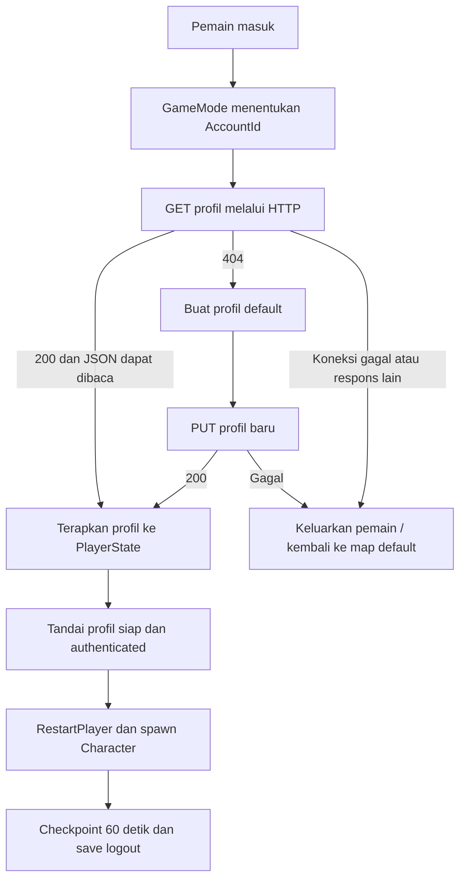

# Audit script dan kesiapan gameplay

Audit pada 15 September 2026 untuk project `GrandCityMobile`, Unreal Engine 5.8.2.

**Kesimpulan: project sudah dapat dikompilasi untuk Windows, tetapi alur masuk dan bermain pada konfigurasi saat ini gagal.** Kode yang tersedia merupakan fondasi prototipe: karakter orang ketiga, kota dari kubus, state multiplayer, dan penyimpanan profil HTTP/PostgreSQL. Sistem RP lengkap belum tersedia.

Laporan ini membedakan hasil uji runtime, temuan dari pembacaan kode, dan bagian yang belum diuji. Audit ini menambahkan dokumentasi; perbaikan source pada tahap sebelumnya dicatat di [UE58_MIGRATION.md](UE58_MIGRATION.md).

## Inventaris source Unreal

Ada **11 file `.cpp`, 12 file `.h`, dan 3 file C# build/target** di `Source/`: total 26 file. Sepuluh pasangan header/implementation membentuk class runtime berikut. Header mendeklarasikan class, properti, callback, dan RPC; implementation menjalankan perilakunya.

| File | Fungsi kode yang tersedia | Kesiapan saat Play |
| --- | --- | --- |
| [GrandCityMobileCharacter.h](../Source/GrandCityMobile/GrandCityMobileCharacter.h), [GrandCityMobileCharacter.cpp](../Source/GrandCityMobile/GrandCityMobileCharacter.cpp) | Kamera orang ketiga dengan spring arm; gerakan berdasarkan arah kamera; berjalan 450 cm/s, sprint 650 cm/s, jump, mouse look. CharacterMovement dan flag sprint direplikasi; sprint menggunakan server RPC dan `OnRep_Sprinting`. | Gerakan desktop terhubung secara kode jika karakter berhasil spawn. Belum teruji dengan input interaktif. Skeletal mesh dan animasi belum dipasang, sehingga tidak ada model avatar yang ditentukan oleh project. Ada potensi sprint tersangkut pada client saat latency. |
| [GrandCityMobileGameMode.h](../Source/GrandCityMobile/GrandCityMobileGameMode.h), [GrandCityMobileGameMode.cpp](../Source/GrandCityMobile/GrandCityMobileGameMode.cpp) | Menentukan Character, PlayerController, PlayerState, dan GameState; mengambil AccountId; memuat profil setelah login; menahan spawn sampai profil siap; checkpoint setiap 60 detik; save saat logout; memperbarui jumlah pemain. | Menjadi penghalang utama Play saat backend/config gagal. Kegagalan load mengeluarkan pemain. Save belum dibatasi ke profil yang telah berhasil dimuat. |
| [GrandCityMobilePlayerController.h](../Source/GrandCityMobile/GrandCityMobilePlayerController.h), [GrandCityMobilePlayerController.cpp](../Source/GrandCityMobile/GrandCityMobilePlayerController.cpp) | Memiliki komponen profil; meneruskan load/save hanya pada authority; menyediakan client RPC untuk flag session initialized dan spawn confirmed. | Jalur load/save terhubung. Flag spawn untuk remote client bermasalah karena RPC dari `OnPossess` dibatasi `IsLocalController()`. Tidak ada HUD/menu atau mekanisme masuk kendaraan. |
| [GrandCityMobilePlayerState.h](../Source/GrandCityMobile/GrandCityMobilePlayerState.h), [GrandCityMobilePlayerState.cpp](../Source/GrandCityMobile/GrandCityMobilePlayerState.cpp) | Mereplikasi AccountId, DisplayName, RegionId, bAuthenticated, level, cash, bank balance, dan reputation. | Properti replikasi sudah terdaftar. Ini penyimpanan state, belum merupakan sistem reward, transaksi uang, progression, atau autentikasi akun. Migrasi state untuk seamless travel belum dibuat. |
| [GrandCityMobileGameState.h](../Source/GrandCityMobile/GrandCityMobileGameState.h), [GrandCityMobileGameState.cpp](../Source/GrandCityMobile/GrandCityMobileGameState.cpp) | Mereplikasi jumlah pemain, nilai population limit 100, RegionId `AFRICA_WEST`, dan ServerId `GC-AFRICA-01`. | State tersedia untuk client. Nilai 100 belum dipakai oleh aturan penerimaan pemain khusus project. Penghitungan sesudah logout berpotensi masih memasukkan controller yang sedang keluar. |
| [GrandCityPlayerProfileComponent.h](../Source/GrandCityMobile/GrandCityPlayerProfileComponent.h), [GrandCityPlayerProfileComponent.cpp](../Source/GrandCityMobile/GrandCityPlayerProfileComponent.cpp) | Memuat profil, menerapkan level/saldo/reputation/nama/region ke PlayerState; membuat profil baru jika GET menghasilkan 404; menyimpan profil baru sebelum mengizinkan spawn; mengambil snapshot PlayerState untuk save. | Kontrak dasar terhubung, tetapi belum ada loaded guard, penanganan lifecycle callback yang aman, dan penghitungan waktu bermain. Save sebelum load selesai berisiko menulis nilai default. |
| [GrandCityDurablePersistenceSubsystem.h](../Source/GrandCityMobile/GrandCityDurablePersistenceSubsystem.h), [GrandCityDurablePersistenceSubsystem.cpp](../Source/GrandCityMobile/GrandCityDurablePersistenceSubsystem.cpp) | GameInstance subsystem untuk GET/PUT profil melalui HTTP; JSON serialization; membaca BaseUrl/ApiKey dari ini; Bearer authorization; callback hasil. GET 200 = profil ada, 404 = profil baru, PUT 200 = save sukses. | Request runtime saat audit gagal karena BaseUrl terpotong oleh parser config. Belum ada retry, version integration, validasi semua field respons, atau penyimpanan lokal/offline. |
| [World/GrandCityWorldSubsystem.h](../Source/GrandCityMobile/World/GrandCityWorldSubsystem.h), [World/GrandCityWorldSubsystem.cpp](../Source/GrandCityMobile/World/GrandCityWorldSubsystem.cpp) | Ketika dunia Game/PIE mulai, otomatis spawn satu actor kota di origin; menyediakan flag Blueprint apakah spawn berhasil. | Actor kota terbukti dibuat pada uji runtime. Dedicated server sengaja dilewati, sehingga collision kota tidak tersedia di server. |
| [World/GrandCityProceduralCity.h](../Source/GrandCityMobile/World/GrandCityProceduralCity.h), [World/GrandCityProceduralCity.cpp](../Source/GrandCityMobile/World/GrandCityProceduralCity.cpp) | Membuat ground, jalan, dan bangunan menggunakan cube mesh engine dan instanced static mesh. Seed tetap; district menentukan variasi tinggi. Default grid 9 menghasilkan 18 instance jalan dan `(9-1)^2 × 5 = 320` bangunan. | Pembuatan actor berjalan, tetapi attachment dan perubahan transform ground menghasilkan warning mobility. Kota masih berupa geometri prototipe. Buildings memakai QueryOnly, sehingga belum menyediakan collision simulasi physics kendaraan. |
| [Vehicles/GrandCityVehicle.h](../Source/GrandCityMobile/Vehicles/GrandCityVehicle.h), [Vehicles/GrandCityVehicle.cpp](../Source/GrandCityMobile/Vehicles/GrandCityVehicle.cpp) | Pawn kendaraan berbentuk kubus: body physics, kamera, throttle dengan AddForce, belok dengan torque, dan gaya rem. | Belum di-spawn atau dipossess oleh alur project. Dapat menjadi eksperimen lokal setelah ditempatkan/dipossess, tetapi belum diuji. Input client belum dikirim ke server dan rem hanya diberi saat tombol pertama ditekan. |

Enam file source/build lainnya:

| File | Fungsi |
| --- | --- |
| [GrandCityAccountTypes.h](../Source/GrandCityMobile/GrandCityAccountTypes.h) | Struktur `FGrandCityAccountIdentity` untuk AccountId, DisplayName, RegionId, dan flag autentikasi. Model data; tidak berisi login/token verification. Tidak ditemukan pemakaian struktur ini dalam alur runtime lainnya. |
| [GrandCityPlayerProfileTypes.h](../Source/GrandCityMobile/GrandCityPlayerProfileTypes.h) | Struktur profil dengan schema version, AccountId, CharacterId, CharacterName, region, level, cash/bank, reputation, total waktu bermain, dan timestamp save. Belum memuat posisi, inventory, kendaraan, property, atau backend revision `version`. |
| [GrandCityMobile.cpp](../Source/GrandCityMobile/GrandCityMobile.cpp) | Mendaftarkan primary game module melalui `IMPLEMENT_PRIMARY_GAME_MODULE`. |
| [GrandCityMobile.Build.cs](../Source/GrandCityMobile/GrandCityMobile.Build.cs) | Menentukan dependensi module untuk engine, input, networking/online, HTTP/JSON, dan kompilasi C++. Ini aturan build, bukan perilaku pemain. |
| [GrandCityMobile.Target.cs](../Source/GrandCityMobile.Target.cs) | Target Game dengan build settings V7 dan include order Unreal 5.8. Target Game Windows telah lulus build. Belum ada target Server khusus di repository. |
| [GrandCityMobileEditor.Target.cs](../Source/GrandCityMobileEditor.Target.cs) | Target Editor dengan pengaturan Unreal 5.8. Target Editor Windows telah lulus build. |

## Backend, konfigurasi, dan aset

| File/folder | Fungsi dan status |
| --- | --- |
| [Backend/src/server.js](../Backend/src/server.js) | Satu script JavaScript aplikasi. Express + pg: `/health` menguji DB; GET `/v1/profiles/:accountId` membaca profil; PUT pada URL yang sama melakukan insert/update dalam transaction; Bearer API key untuk `/v1`; validasi AccountId; pemeriksaan revision opsional. Sintaks Node lulus, tetapi API dan PostgreSQL belum diuji bersama. |
| [Backend/db/init.sql](../Backend/db/init.sql) | Satu script SQL: tabel player_profiles, satu row per AccountId, constraint dasar level/saldo, revision, timestamps, indeks region, dan trigger updated_at. |
| [Backend/package.json](../Backend/package.json) | Dependensi Express/pg dan perintah start. Tidak menyediakan automated test script; tidak ada lockfile dependency pada inventaris ini. |
| [Backend/Dockerfile](../Backend/Dockerfile) | Image Node 22 Alpine untuk install dependency dan menjalankan API. |
| [Backend/docker-compose.yml](../Backend/docker-compose.yml) | PostgreSQL 17 + API port 8080, healthcheck DB, volume permanen, dan init.sql. Inisialisasi SQL hanya dijalankan saat volume DB baru diinisialisasi. API key default berbeda dengan config Unreal. |
| [Config/DefaultEngine.ini](../Config/DefaultEngine.ini) | Memilih GameMode project dan pengaturan engine/render/platform. Project belum menentukan GameDefaultMap/EditorStartupMap sendiri. |
| [Config/DefaultInput.ini](../Config/DefaultInput.ini) | Mapping WASD/mouse/Space/Shift, input kendaraan, dan virtual joystick bawaan. Mapping gerakan untuk axis joystick/gamepad belum dibuat. |
| [Config/DefaultGame.ini](../Config/DefaultGame.ini) | BaseUrl dan ApiKey persistence. Nilai URL membutuhkan tanda kutip pada engine ini. |
| [GrandCityMobile.uproject](../GrandCityMobile.uproject) | Descriptor project, engine association, module, dan plugin yang diaktifkan; bukan script gameplay. |
| `Content/` | Hanya `.gitkeep` pada inventaris file: **0 `.umap` dan 0 `.uasset` project**. Tidak ada map, Blueprint gameplay, model karakter, animation, UI widget, InputAction, atau InputMappingContext project. Aset cube, virtual joystick, dan map yang digunakan saat uji berasal dari engine. |
| `Plugins/GrandCityOpenAI/` | Hanya `VENDOR_EXECUTION.md`; tidak ditemukan `.uplugin`, source module, atau implementasi integrasi AI di folder ini. |
| `Docs/` dan README | Dokumen desain/rencana serta catatan implementasi. Fitur dalam dokumen perlu dicocokkan dengan source; inventory/jobs/property dan beberapa sistem jaringan disebut sebagai planned components. |

## Alur permainan yang benar-benar dibuat



Tidak ada fallback offline: keberhasilan load atau pembuatan profil adalah syarat spawn. Kota dibuat secara terpisah oleh WorldSubsystem, sehingga kota bisa muncul ketika karakter belum muncul. Flag `authenticated` saat ini berarti profil berhasil dimuat; belum membuktikan identitas akun pemain.

## Hasil pengujian

| Pemeriksaan | Hasil dan batasnya |
| --- | --- |
| Build Editor Win64 Development sebelumnya | Succeeded, lihat [UE58-Editor-Build.log](../Saved/Logs/UE58-Editor-Build.log), baris 160. Membuktikan source dapat dikompilasi dan ditautkan. |
| Build Game Win64 Development sebelumnya | Succeeded, lihat [UE58-Game-Build.log](../Saved/Logs/UE58-Game-Build.log), baris 157. Belum merupakan packaging. |
| Startup editor sebelumnya | Module dimuat dan keluar normal; pemeriksaan ini tidak menjalankan gameplay. |
| `node --check Backend/src/server.js` | Exit 0: sintaks JavaScript valid. Tidak membuktikan akses DB, endpoint, atau persistensi. |
| `GET http://127.0.0.1:8080/health` menggunakan curl | Connection refused saat audit: health endpoint tidak dapat diakses dari komputer ini. Command Docker juga tidak ditemukan di PATH sesi audit. |
| Game headless terpisah, map `/Engine/Maps/Entry`, `AccountId=AUDIT-LOCAL`, NullRHI, timer 12 detik | Engine menjalankan GameMode project. Snapshot object awal berisi **0 Character** dan **1 actor kota**; GET profil kemudian gagal, fallback map dimuat berulang, dan PUT logout juga gagal. Proses keluar normal dengan kode 0. Lihat [Gameplay-Audit-NoBackend.log](../Saved/Logs/Gameplay-Audit-NoBackend.log). |

Uji game menggunakan proses terpisah dari editor interaktif pengguna. NullRHI tidak menampilkan rendering. Tidak dilakukan pengujian keyboard/touch, dua pemain, dedicated server, latency sprint, driving, save ke database aktif, atau packaging Android.

Bukti runtime dalam `Gameplay-Audit-NoBackend.log`:

- Baris 1397: `Game class is 'GrandCityMobileGameMode'`.
- Baris 1403–1405: attachment komponen Static ke CityRoot yang bukan Static dibatalkan.
- Baris 1406: perubahan transform Ground Static menghasilkan warning mobility.
- Baris 1436–1439: snapshot class Character menghasilkan `0 Objects`.
- Baris 1444: actor `GrandCityProceduralCity_0` ada.
- Baris 1456: `GET http:/v1/profiles/AUDIT-LOCAL` gagal dengan ConnectionError.
- Baris 1457, 1495, 1532, 1569: fallback `/Engine/Maps/Templates/OpenWorld?closed` dimuat berulang.
- Baris 1490: PUT untuk akun audit tetap dicoba setelah GET gagal. Backend tidak menerima request pada uji ini; kehilangan data tidak terjadi/dibuktikan oleh pengujian tersebut.
- Baris 1603 dan 1648: permintaan keluar dengan status 0 dan proses berakhir.

## Masalah yang menghalangi Play

### 1. BaseUrl terpotong oleh parser ini — terbukti runtime dan source engine

`Config/DefaultGame.ini:2` berisi `BaseUrl=http://127.0.0.1:8080` tanpa quotes. UE 5.8.2 memproses komentar `//` di luar quotes: `ConfigCacheIni.cpp:1931` memakai `SwallowDoubleSlashComments`, dan `Parse.cpp:1244` menangani komentar tersebut. Exporter config pada `ConfigCacheIni.cpp:2266` juga mencatat bahwa `//` tanpa quotes ditafsirkan sebagai komentar.

Nilai yang dibaca menjadi `http:`. `GetBaseUrl()` hanya menggunakan fallback jika nilai kosong, sehingga URL yang dibentuk adalah `http:/v1/profiles/...`, persis seperti log. Bentuk config yang diperlukan adalah:

```ini
BaseUrl="http://127.0.0.1:8080"
```

Selain membenarkan format URL, API harus dapat dijangkau dari mesin game server.

### 2. Backend tidak dapat dijangkau dan API key default berbeda

Health endpoint localhost port 8080 menolak koneksi saat audit. Bahkan bila compose default dijalankan, `Config/DefaultGame.ini:3` memakai `replace-with-server-secret`, sedangkan `Backend/docker-compose.yml:23` memakai `replace-with-a-long-random-secret`. Backend membandingkan Bearer secara persis dan akan menghasilkan 401 jika berbeda (`server.js:13`, `:47`).

GameMode baru memanggil RestartPlayer setelah callback load sukses. Karena itu, memperbaiki build saja belum menghasilkan karakter yang dapat dimainkan. Pada uji standalone, kegagalan load juga menyebabkan kembali ke map fallback yang memakai GameMode sama, kemudian mengulangi load/failure/travel. Dibutuhkan alur menu/error yang tidak langsung mengulang login.

### 3. Mobility kota tidak konsisten — terbukti runtime

CityRoot dibuat tanpa pengaturan mobility, sedangkan Ground/Roads/Buildings diberi Static. Attachment ditolak pada runtime. Generator juga memindahkan/mengubah skala Ground Static di BeginPlay. Root dan anak perlu mobility yang konsisten, dan perubahan transform perlu dilakukan pada tahap/mobility yang mendukungnya.

Actor kota berhasil dibuat; warning ini bukan bukti bahwa seluruh geometri pasti hilang. Namun attachment dan transform belum dapat dianggap benar sebelum diperbaiki dan diuji secara visual/collision.

## Risiko gameplay dan penyimpanan dari alur kode

Temuan berikut belum semuanya direproduksi secara dinamis; kondisi pemicunya dijelaskan agar bisa diuji dengan tepat.

| Temuan | Kondisi pemicu dan dampak | Sumber utama / perbaikan yang diperlukan |
| --- | --- | --- |
| Save profil sebelum load sukses | Checkpoint atau logout saat GET masih pending/gagal dapat menyalin saldo/level default serta CharacterId kosong, lalu membuat/menimpa row lama jika PUT dapat mencapai backend. PUT setelah GET gagal terlihat di log, tetapi overwrite DB belum diuji. | `GameMode.cpp:105`, `:173`; `ProfileComponent.cpp:88`, `:133`; `server.js:63`. Wajib guard profil loaded dan hanya save pemain siap. |
| Revision concurrency tidak digunakan | Backend menawarkan version conflict opsional, tetapi Unreal tidak membaca/mengirim version dan mengabaikan profil hasil PUT. Dua sesi atau snapshot terlambat dapat menimpa state terbaru. | `server.js:33`, `:70`; ProfileTypes dan HTTP subsystem. Tambahkan revision end-to-end, konflik, dan pengaturan sesi. |
| Callback menangkap raw this | HTTP load dapat selesai setelah component/GameMode dihancurkan saat disconnect, stop PIE, atau travel. Callback berpotensi mengakses object yang sudah tidak valid. Weak pointer pemain saja tidak melindungi GameMode. | `ProfileComponent.cpp:36`, `GameMode.cpp:86`. Gunakan weak object capture dan validity/lifecycle guards. |
| Save failure diabaikan | Checkpoint/logout menggunakan callback kosong. Belum ada retry, laporan kegagalan save, atau alur menunggu save sebelum shutdown/transfer. | `GameMode.cpp:105`, `:177`. Tambahkan observability dan penanganan save completion/failure. |
| Profil HTTP tidak divalidasi lengkap | Respons 200 dengan objek JSON yang kehilangan field tetap dapat dianggap berhasil karena return TryGet diabaikan. SchemaVersion belum memiliki migration/compatibility handling. | `DurablePersistenceSubsystem.cpp:20`, `:73`. Validasi identitas, field wajib, schema, dan nilai numerik. |
| Identitas akun belum diautentikasi | AccountId berasal dari connection option tanpa bukti token; profil yang berhasil dimuat mengubah bAuthenticated=true. Pemain dapat mengklaim identitas lain pada flow development ini. LOCAL-playerId berubah menurut urutan join dan tidak stabil setelah restart. | `GameMode.cpp:46`, `:53`, `:143`. Hubungkan autentikasi akun dan identitas stabil. |
| Parsing connection option kurang tepat | FParse::Value tidak berhenti pada separator URL `?`. AccountId yang diikuti option lain dapat ikut menyerap option tersebut dan ditolak regex backend. | `GameMode.cpp:46`; engine `Parse.cpp:299`. Gunakan parser option URL, misalnya `UGameplayStatics::ParseOption`. |
| Spawn flag remote client | OnPossess berjalan di server, tetapi server controller milik remote client bukan local controller. ClientNotifySpawned tidak dikirim untuk kasus itu. | `PlayerController.cpp:23`. Kirim owner RPC dari authority atau gunakan lifecycle possession client yang sesuai. |
| Online count sesudah logout | Update dijalankan ketika controller yang keluar masih berada dalam lifecycle removal engine, sehingga jumlah bisa tetap mencakup pemain itu sampai pembaruan berikutnya. | `GameMode.cpp:109`; engine `Controller.cpp:603`, `:610`, `GameModeBase.cpp:179`. Perbarui pada waktu removal yang tepat. |
| Kota tidak ada pada dedicated server | WorldSubsystem keluar sebelum spawn pada NM_DedicatedServer. Client memiliki ground/gedung, server tidak. Tanpa collision map lain, gerakan server dapat jatuh atau dikoreksi berbeda dari tampilan client. | `WorldSubsystem.cpp:17`. Sediakan collision dunia yang sama pada server dan client. |
| Sprint client bisa tersangkut | Shift dilepas sebelum nilai true dari server direplikasi; StopSprint melihat bIsSprinting=false dan tidak mengirim false RPC. | `Character.cpp:99`. Pisahkan keinginan input lokal dari state replicated atau kirim release secara konsisten. Belum diuji dengan latency. |
| Kendaraan belum masuk alur permainan | Tidak ada spawn/enter/exit/possess kendaraan; default pawn tetap Character. | `GameMode.cpp:14` dan pencarian seluruh Source. Tambahkan actor/spawn serta interaksi masuk/keluar. |
| Driving multiplayer belum lengkap | Throttle/steer hanya mengubah variabel lokal; tidak ada server input RPC/authority physics flow. APawn engine mewariskan replikasi actor/movement dasar, tetapi itu belum menyelesaikan sinkronisasi input kendaraan. | `Vehicle.cpp:48`, `:73`, `:78`. Implementasikan alur driving yang dikendalikan server dan uji dua client. |
| Rem hanya sekali | VehicleBrake memakai IE_Pressed dan AddForce sekali; menahan tombol tidak menerapkan pengereman berkelanjutan. | `Vehicle.cpp:45`, `:88`. Simpan state brake dan terapkan selama tombol ditahan. |
| Physics kendaraan melewati gedung | Buildings memakai QueryOnly, yang mendukung query/sweep tetapi tidak collision rigid-body simulation kendaraan. | `ProceduralCity.cpp:29`. Sediakan collision QueryAndPhysics untuk objek yang perlu menahan kendaraan. |
| Joystick Android belum terhubung | Virtual joystick bawaan mengirim axis gamepad, sedangkan mapping MoveForward/MoveRight/Turn/LookUp hanya keyboard/mouse. AxisConfig hanya dead zone. Tidak ada tombol touch jump/sprint/brake. | `DefaultInput.ini:85`–`:101`. Tambahkan mapping axis dan UI/input touch. |
| Waktu bermain tidak bertambah | TotalPlayTimeSeconds hanya dibaca/disimpan; tidak ada akumulasi durasi sesi. | `ProfileTypes.h:39`, `DurablePersistenceSubsystem.cpp:31`, `:102`. Hitung waktu pada authority sebelum snapshot. |
| Tidak menyimpan lokasi dan state RP | Profil tidak mempunyai transform, inventory, kendaraan, property, atau state pekerjaan. Rejoin tidak dapat memulihkan hal-hal tersebut melalui API yang tersedia. | ProfileTypes, ReadProfile, JSON PUT, dan init.sql. Perlu model data/endpoint serta logic tambahan sesuai fitur. |
| Presisi angka besar terbatas | BIGINT/int64 dikonversi ke JavaScript Number dan JSON number. Nilai di atas integer aman 2^53−1 tidak semuanya dapat dipertahankan persis; misalnya 9007199254740993 dibulatkan menjadi 9007199254740992. | `server.js:28`–`:33`, `:100`–`:105`, JSON serialization Unreal. Gunakan string desimal atau batas safe integer yang tervalidasi. |
| Validasi backend terbatas | String kosong lolos cek tipe; finite/integer/range/schema numeric tidak diperiksa lengkap. Input salah dapat menjadi DB error. Error GET/query dan pool.connect tidak seluruhnya memakai structured handler yang sama. | `server.js:54`, `:63`, `:67`, `:99`–`:105`. Tambahkan validasi kontrak dan penanganan DB failure. |

Legacy axis/action binding karakter tidak otomatis rusak karena project menggunakan class EnhancedInput. Engine EnhancedPlayerInput tetap memanggil jalur legacy, dan Epic mendokumentasikan backward compatibility. Ketiadaan mapping joystick adalah temuan yang berbeda. Referensi: [Enhanced Input, dokumentasi Epic](https://dev.epicgames.com/documentation/unreal-engine/enhanced-input-in-unreal-engine).

## Fitur yang belum ditemukan implementasinya

Tidak ditemukan script/aset project untuk inventory, pekerjaan dan reward, transaksi economy, property/rumah, toko, NPC/traffic, interaksi objek, chat/voice, combat/health/death, character customization, login UI, server browser/matchmaking, session lease/transfer antarserver, atau integrasi OpenAI. World Partition/HLOD custom untuk kota project juga belum dibuat; map fallback engine yang memakai World Partition tidak membuktikan fitur kota project tersebut sudah diimplementasikan.

[GRAND_CITY_ARCHITECTURE.md](GRAND_CITY_ARCHITECTURE.md) menyebut sejumlah komponen sebagai planned components dan fase pengembangan. [OPENAI_PLUGIN_INTEGRATION.md](OPENAI_PLUGIN_INTEGRATION.md) juga mencatat integrasi yang belum diport. Dokumen desain memberikan target pengembangan, sedangkan kesiapan Play ditentukan oleh source, aset, service, dan hasil uji.

## Urutan perbaikan dan verifikasi

1. Benarkan quoting BaseUrl, jalankan API/PostgreSQL, samakan secret, dan uji health serta GET/PUT akun audit.
2. Perbaiki penanganan load failure/menu, loaded guard, callback lifecycle, save failure, dan revision sebelum memakai data pemain nyata.
3. Perbaiki mobility/transform kota, collision physics, dan keberadaan collision di server. Sediakan map serta PlayerStart yang dapat diuji secara konsisten.
4. Pasang mesh/animasi karakter; uji berjalan, kamera, jump, sprint, reconnect, dan save/load dengan input desktop nyata.
5. Hubungkan kendaraan ke spawn/enter/exit, perbaiki driving server dan brake, lalu uji listen/dedicated server dengan dua client dan latency.
6. Hubungkan input touch/gamepad, validkan Android SDK, kemudian build/package dan uji di perangkat Android.
7. Kembangkan fitur RP yang belum tersedia dengan kontrak data dan pengujian sesuai tiap fitur.

Status yang dapat dinyatakan sekarang: **build Windows lulus; prototipe kota menjalankan code tetapi mengeluarkan warning; flow profil/spawn gagal pada config/service saat audit; gameplay interaktif, multiplayer penuh, database aktif, dan Android belum tervalidasi.**
